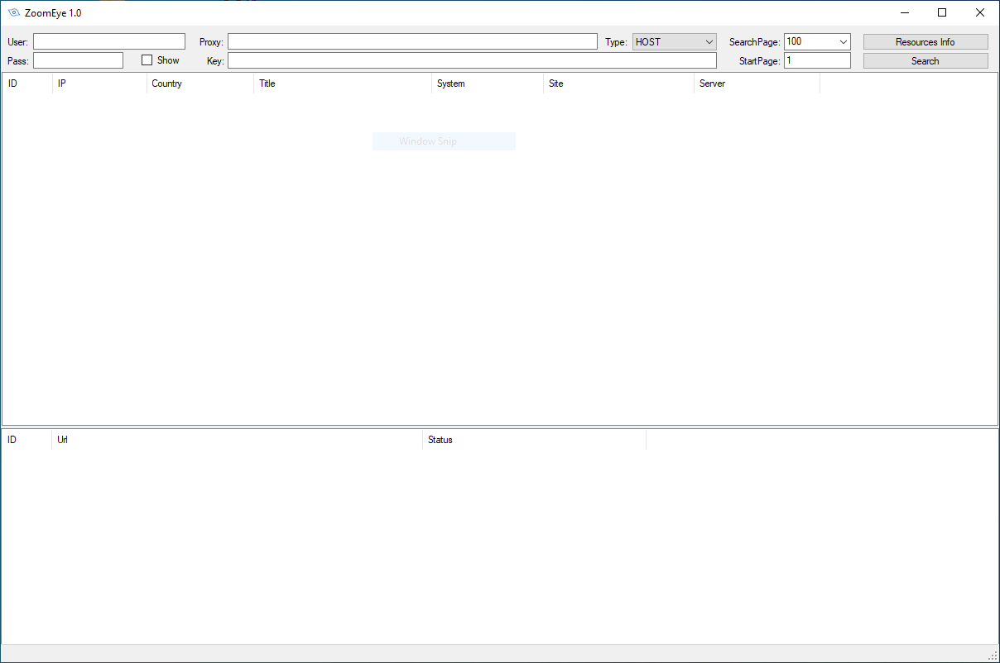

# ZoomEye
GUI tool

# basic
vs2022 + net4.8 + c#

# usage

Enter User name and Password.

Enter search query and press search.
to get the right query go to ZoomEye site enter your search and copy paste after: "q=" xyz

Right click on the results for export to CSV
WEB is not working yet.

Proxy:  Leave Empty
<pre>
    HTTP://127.0.0.1:8080  
    SOCKS5://127.0.0.1:1080 
</pre>
